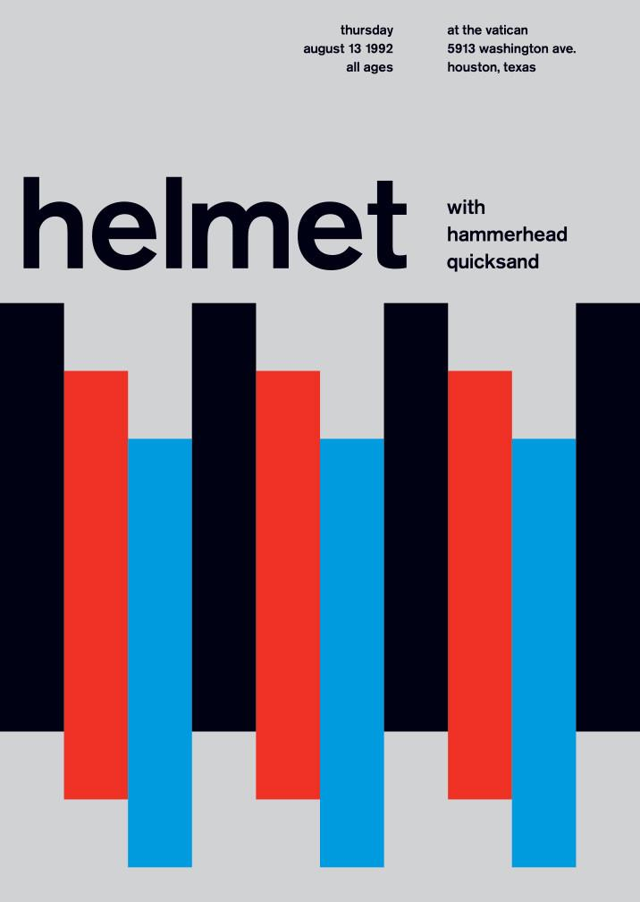

# Module 1 - Project 2 - HTML & CSS Layouting

## Responsive Poster

[Live site](https://av-poster.netlify.app)

## Description

The second project in Module 1 in the Reykjavík Academy of Web Development, a poster in HTML5 and CSS.

I used CSS grid, flexbox, and some CSS animation for some fun. The goal was to have it fully responsive, so I used vw sizing for font-size. Not great for accessiblity, but for this purpose I found it useful.

### Inspiration

I recreated a poster found on [swissted.com](https://www.swissted.com/products/helmet-at-the-vatican-1992#&gid=1&pid=1).

testing
